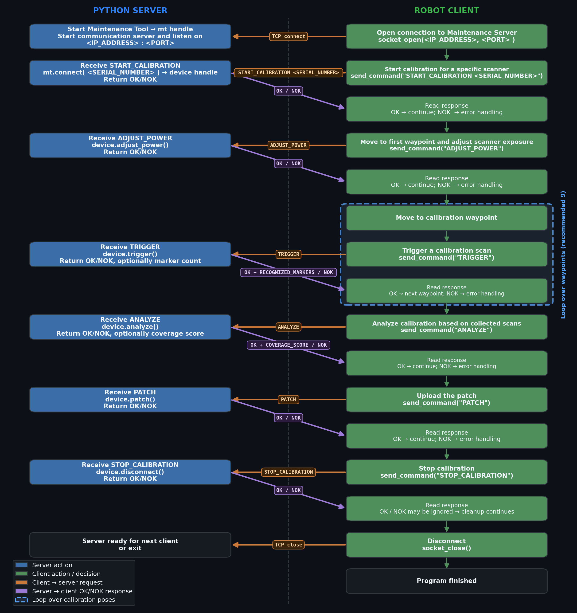

# MaintenanceTool robot-controlled calibration

Shows how to drive a `MaintenanceTool` calibration session (see
[`maintenance_tool_api_example.py`](../maintenance_tool_api_example.py) for the single-process
version) from a robot controller over the network, instead of interactively from the same machine
that runs `phoxi_api`.

## Architecture

`robot_controlled_server.py` runs on the PC that has PhoXi Control and `phoxi_api` installed. It
owns the actual `MaintenanceTool` device session and exposes it as a TCP server (default port
`2222`). The robot controller acts as the TCP **client**: it connects, moves to each calibration
waypoint, and sends a line command after each move to drive the session forward. This lets the
calibration sequencing live on the robot (which knows the waypoints) while the PhoXi API calls
stay on the PC.

- [`robot_controlled_server.py`](robot_controlled_server.py) — TCP server wrapping the
  `MaintenanceTool` API. Run this first.
- [`localhost_client_simulator.py`](localhost_client_simulator.py) — interactive localhost client
  for manually exercising the server's commands without robot hardware, e.g. while troubleshooting.
- [`ur_client_example.script`](ur_client_example.script) — ready-to-run Universal Robots program
  implementing the full calibration sequence as the TCP client. Only requires setting the server
  IP/port and 9 calibration waypoints (`p1`...`p9`).

## Command protocol

One command per line, answered with a single `OK[, ...]` or `NOK:<reason>` line:

| Command | Description |
|---|---|
| `START_CALIBRATION <serial>` | Connect to the device and start a maintenance session. |
| `ADJUST_POWER` | Adjust laser power and LED intensity for suitable exposure. |
| `TRIGGER` | Acquire one calibration scan at the current robot pose. Response includes the recognized marker point count. |
| `ANALYZE` | Analyze acquired scans and report the area/coverage occupancy score. |
| `PATCH` | Apply the prepared correction patch to the device. This disconnects the device. |
| `STOP_CALIBRATION` | Release the device and end the session (does not disconnect a device already released by `PATCH`). |

## Underlying `phoxi_api.MaintenanceTool` calls

| Call | Purpose |
|---|---|
| `MaintenanceTool()` | Load the native MaintenanceTool library (uses `PHOXI_CONTROL_PATH`). |
| `mt.get_maintenance_tool_api_version()` | Read the loaded MaintenanceTool API version. |
| `mt.check_phoxi_control_compatibility()` | Check whether the installed PhoXi Control is compatible. |
| `mt.connect(serial_number)` | Connect to a device and create an active maintenance session. |
| `device.disconnect()` | Disconnect the active device session. |
| `device.adjust_power()` | Adjust laser power / LED intensity. |
| `device.trigger()` | Acquire one calibration scan; returns `.count_of_recognized_marker_points` and `.count_of_acquired_scans`. |
| `device.analyze()` | Analyze acquired scans; returns the area/coverage occupancy score. |
| `device.patch()` | Apply the prepared correction patch. |
| `device.restore()` | Restore the device to factory calibration (not exposed over the wire protocol above, but available on the `device` handle). |

## Calibration procedure flowchart



## Running

1. On the PC, with PhoXi Control running and the device connected:
   ```bash
   uv run examples/maintenance_tool_robot_calibration/robot_controlled_server.py
   ```
2. Either:
   - Deploy `ur_client_example.script` to a Universal Robots controller, set `SERVER_IP` /
     `SERVER_PORT` / `DEVICE_SN`, teach the 9 calibration waypoints (`p1`...`p9`), and run it; or
   - Run `localhost_client_simulator.py` on the same PC (or any machine that can reach the server)
     to send commands manually:
     ```bash
     uv run examples/maintenance_tool_robot_calibration/localhost_client_simulator.py
     ```

## Prerequisites

- PHOXI_CONTROL_PATH environment variable pointing to the PhoXi Control installation directory.
- PhoXi Control running, with the target device visible to it.
- For the robot client: a Universal Robots controller able to reach the server's IP/port, or any
  TCP client able to speak the line protocol above.
